# HTML5笔记

## 响应式布局
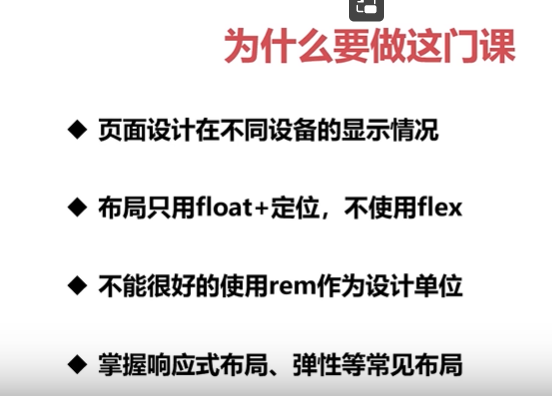
### 使用媒体查询（pc端 移动端）
1. 什么是媒体查询？ 为不同尺寸的屏幕设定不同的css样式
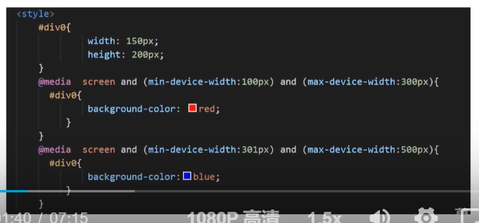
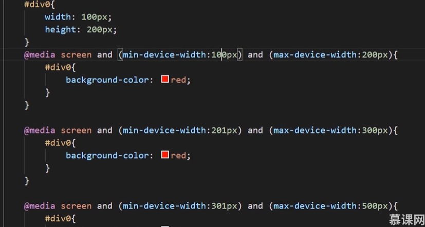

2. @media常用参数
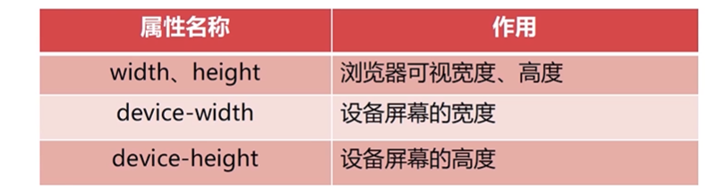
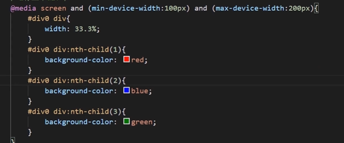

3. 媒体查询其他的引入方式
在style标签中引入，内部样式表
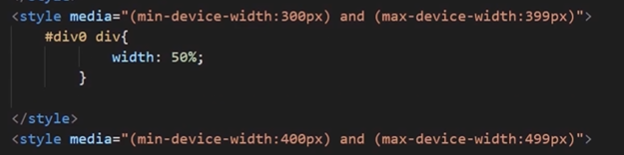
link引入，写在link标签中，有条件的引入外部样式表
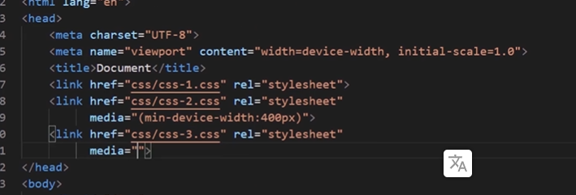

### flex
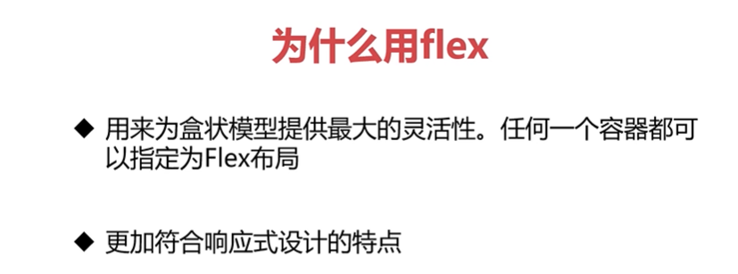

flex-derection:子元素再父元素盒子中的排列方式

flex-wrap：是否换行
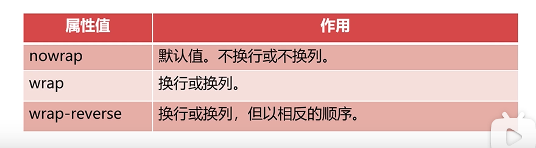
flex-flow

justify-content：用来在存在剩余空间时，设置为间距的方式
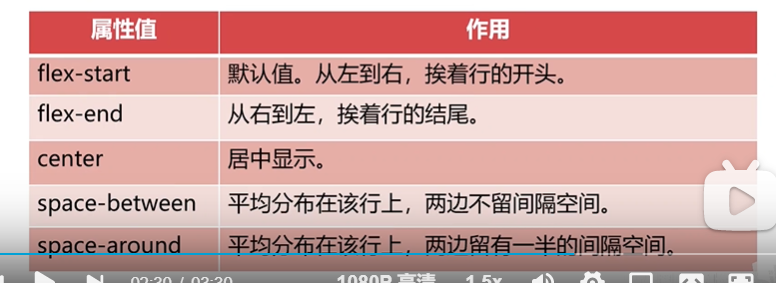
align-items：设置每个flex元素在交叉轴上的默认对齐方式（每一个来处理）
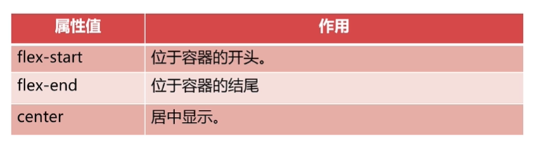
align-content：设置每个flex元素在交叉轴上的对齐方式（整体处理）
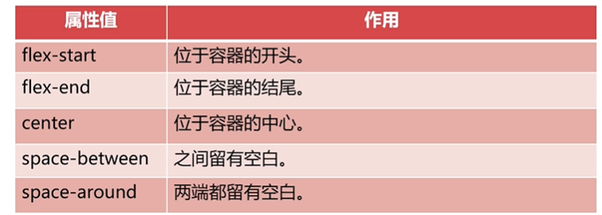

其他属性
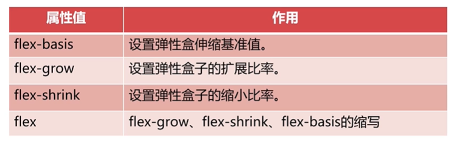

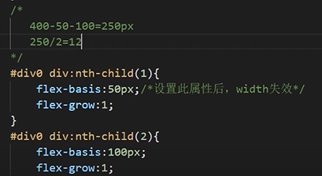
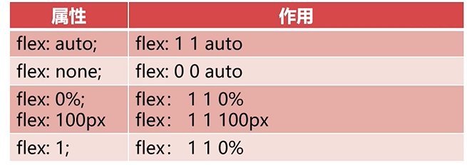

## rem的使用方法
相对于个根元素的字体大小的单位
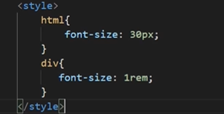

使用js判断用户设备跳转页面
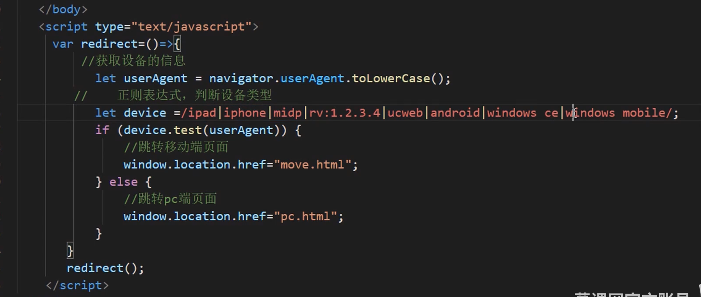