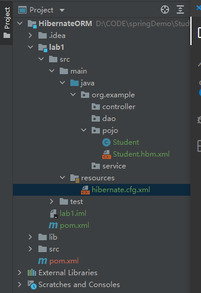

# HibernateORM学习笔记
## 01 配置环境及初始化项目

1. 创建实体类Student.java
~~~java
package org.example.pojo;

public class Student {
    private Integer id;
    private String name;
    private String age;

    public Student() {
    }

    public Student(Integer id, String name, String age) {
        this.id = id;
        this.name = name;
        this.age = age;
    }

    public Integer getId() {
        return id;
    }

    public void setId(Integer id) {
        this.id = id;
    }

    public String getName() {
        return name;
    }

    public void setName(String name) {
        this.name = name;
    }

    public String getAge() {
        return age;
    }

    public void setAge(String age) {
        this.age = age;
    }

    @Override
    public String toString() {
        return "Student{" +
                "id=" + id +
                ", name='" + name + '\'' +
                ", age='" + age + '\'' +
                '}';
    }
}
~~~
2. 在src/main/resources下创建映射文件Student.hbm/xml
