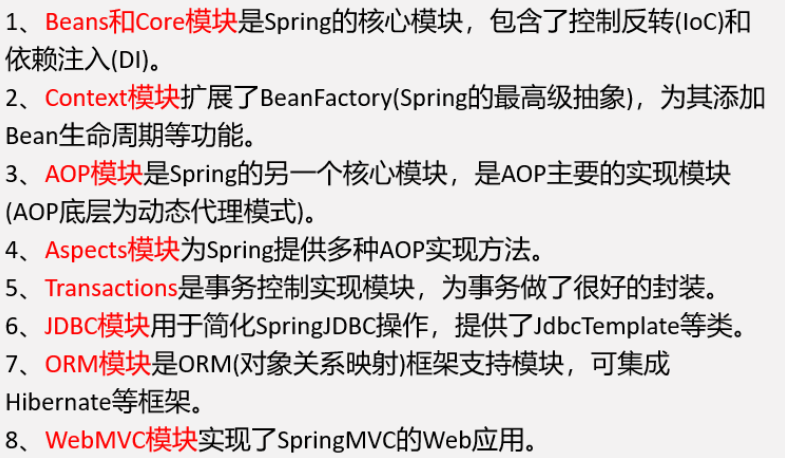
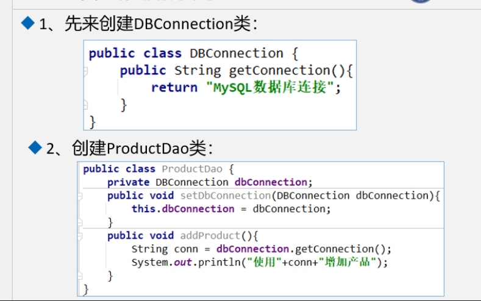
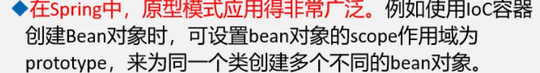
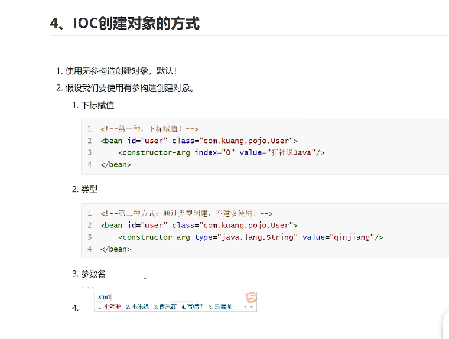

# Spring架构与设计

## 01 软件架构设计原则、反射

> spring是一个Spring是一个开源免费框架，根本使命：“简化企业级应用开发”（全方位地简化了Java开发）。具有**轻量级，最小侵入性，面向bean编程BOP，控制反转IoC、依赖注入DI，面向切面AOP，对事务支持，兼容各类主流框架**的特点。




> **设计模式**（Design Pattern）共23种，是前辈们对代码开发经验的总结，是解决特定问题的一系列套路，它不是语法规定，而是一套用来**提高代码的可复用性、可维护性、可读性、稳健性以及安全性**的解决方案。

### 1.1 Spring中常用的设计模式

| 设计模式 | 一句话总结 | Spring举例 |
| :------: | :-------------------- | :--------: |
| 工厂模式   | 只对结果负责，封装创建过程|  BeanFactory   |
| 单例模式   |  保证独一无二           |  ApplicationContext  |
| 原型模式   |  拔一根猴毛，吹出千万个猴子 |       PrototypeBean       |
| 代理模式   | 找人办事，增强职责 |         AopProxy          |
| 委派模式   |  干活算你的，功劳算我的 | DispatcherServlet |
| 策略模式 | 用户选择，结果统一 | Jdbc的RowMapper |
| 模板模式 | 流程标准化，自己实现定制 | JdbcTemplate |
| **适配器模式** | **兼容转换头** | **HandlerAdapter** |
| **装饰器模式** | **包装，同宗同源，属于同一类** | **InputStream** |
| **观察者模式** | **在任务完成时通知** | **ContextLoaderListener** |

### 1.2 软件架构设计原则

* **开闭原则**：（Open-Closed Principle,OCP）是指一个软件实体（如类、模块和函数）应该对扩展开放，对修改关闭

  代码例子：课程打折优惠

  ~~~java
  package demo1;
  
  public class JavaDiscountCourse extends JavaCourse{
      public JavaDiscountCourse(Integer id, String name, Double price) {
          super(id, name, price);
      }
  
      @Override
      public Double getPrice() {
          return super.getPrice()*0.6;
      }
      public Double getOriginPrice(){
          return  super.getPrice();
      }
  }
  
  ~~~

  

* **依赖倒置原则**：（Dependence Inversion Principle,DIP）是指设计代码结构时，高层模块不应该依赖底层模块，二者都应该依赖其抽象
  抽象不应该依赖细节，细节应该依赖抽象

  ```java
  package demo2;
  public interface ICourse {
      void study();
  }
  
  package demo2;
  public class JavaCourse implements ICourse {
      @Override
      public void study() {
          System.out.println("Tom在学习java课程");
      }
  }
  
  package demo2;
  public class PythonCourse implements ICourse{
      @Override
      public void study() {
          System.out.println("Tom在学习Python课程");
      }
  }
  
  package demo2;
  public class Tom {
      public void study(ICourse icourse){
          icourse.study();
      }
  }
  
  package demo2;
  public class DIPTest {
      public static void main(String[] args) {
          Tom tom = new Tom();
          tom.study(new JavaCourse());
          tom.study(new PythonCourse());
      }
  }
  
  ```

* **单一职责原则**：单一职责原则（Simple Responsibility Principle,SRP）是指不要存在多于一个导致类变更的原因.

  假设有一个类负责两个职责，一旦发生需求变更，修改其中一个职责的代码，有可能导致另一个职责的功能发生故障

  **总体来说，就是一个类、接口或方法只负责一项职责**

  ```java
  package demo3;
  public class LiveCourse {
      public void study(String courseName){
          System.out.println(courseName+"不能快进看");
      }
  }
  
  package demo3;
  public class ReplayCourse {
      public void study(String courseName){
          System.out.println(courseName+"可以反复看");
      }
  }
  
  package demo3;
  public class SRPTest {
      public static void main(String[] args) {
          LiveCourse liveCourse = new LiveCourse();
          liveCourse.study("直播课");
  
          ReplayCourse replayCourse = new ReplayCourse();
          replayCourse.study("录播课");
      }
  }
  
  ```

  

* **接口隔离原则**：（Interface Segregation Principle,ISP）是指用多个专门的接口，而不是用单一的总接口，客户端不应该依赖它不需要的接口



  不把游泳、吃和飞写在一个接口，狗不能飞

  ```java
  package demo4;
  
  public class Dog implements IEateAnimal,ISwimAnimal{
      @Override
      public void eat() {
          System.out.println("狗可以吃饭");
      }
  
      @Override
      public void swim() {
          System.out.println("狗可以游泳");
      }
  }
  ```

* **迪米特原则**：（Law of Demeter,LoD）是指一个对象应该对其他对象保持最少的了解

  

* **里氏替换原则**（Liskov Substitution Principle,LSP）：一个软件实体如果适用于一个父类，那么一定适用于其子类

  

* **合成复用原则**：（Composite/Aggregate Reuse Principle,CARP）是指尽量使用对象组合(has-a)/聚合(contains-a)而不是继承关系达到软件复用的目的

### 1.3 反射机制

```java
 Test test = new Test();
 Class c4 = test.getClass();
 Constructor[] constructors ;
 constructors = c4.getDeclaredConstructors();

public Test(int age, String name) {
        this.age = age;
        this.name = name;
        System.out.println("hello" + name + "i am" + age);
    }

private Test(String name) {
    this.name = name;
    System.out.println("My Name is" +
            name);
}

 Class[] p = {int.class,String.class};
 constructors = c4.getDeclaredConstructor(p);
 constructors.newInstance(24,"HuangLinqing");


  constructors.setAccessible(true);//调用私有构造方法
```

* 动态与静态语言：

  **动态语言：**在运行时代码可以根据某些条件改变自身结构。

  如C#、JavaScript、PHP、Python等

  **静态语言：**运行时结构不可变的语言。如Java、C、C++

**Reflection(反射)：**允许程序在执行期取得类的任何内部信息（如：类名、接口、方法、属性等），并能直接操作任意对象的内部属性及方法（包括private修饰的），将**java变成准动态语言**


* **得到class的三种方式**

  ```java
   1 //1、通过对象调用 getClass() 方法来获取,通常应用在：比如你传过来一个 Object
   2 //  类型的对象，而我不知道你具体是什么类，用这种方法
   3 　　Person p1 = new Person();
   4 　　Class c1 = p1.getClass();
   5         
   6 //2、直接通过 类名.class 的方式得到,该方法最为安全可靠，程序性能更高
   7 //  这说明任何一个类都有一个隐含的静态成员变量 class
   8 　　Class c2 = Person.class;
   9         
  10 //3、通过 Class 对象的 forName() 静态方法来获取，用的最多，
  11 //   但可能抛出 ClassNotFoundException 异常
  12 　　Class c3 = Class.forName("com.ys.reflex.Person");
  ```

* **通过 Class 类获取成员变量、成员方法、接口、超类、构造方法等**

  |                     方法名                     | 功能说明                                                     |
  | :--------------------------------------------: | ------------------------------------------------------------ |
  |                   getName()                    | 获得类的完整名字                                             |
  |                  getFields()                   | 获得类的public类型的属性                                     |
  |              getDeclaredFields()               | 获得类的所有属性。包括private 声明的和继承类                 |
  |                  getMethods()                  | 获得类的public类型的方法                                     |
  | getMethod(String name, Class[] parameterTypes) | 获得类的特定方法，name参数指定方法的名字，parameterTypes 参数指定方法的参数类型 |
  |               getConstructors()                | 获得类的public类型的构造方法                                 |
  |     getConstructor(Class[] parameterTypes)     | 获得类的特定构造方法，parameterTypes 参数指定构造方法的参数类型 |
  |                 newInstance()                  | 通过类的不带参数的构造方法创建这个类的一个对象               |

  

## 0 2 **IoC与DI①工厂、单例、原型模式详解**

### 2.1 简单工厂模式

> 简单工厂模式（Simple Factory Pattern）是指由一个工厂对象决定创建哪一种产品类的实例，但它不属于GoF的23种设计模式。
>
> 适用于工厂类负责创建的对象较少的场景且客户端只需要传入工厂类的参数，对于如何创建对象不需要关心。

### 2.2 工厂方法模式

> 简单工厂模式由于工厂类的职责过重，不易于扩展过于复杂的产品结构。若每个课程的创建逻辑有区别，随着产品增多，会变得更不易于维护。
>
> 工厂类方法模式是定义一个创建对象的接口，但让实现这个接口的类来决定实例化那个类。
>
> 但此方法类的个数容易过多，增加复杂度。

### 2.3 抽象工厂模式

> 提供一个一系列相关或互相依赖对象的接口
>
> 例如实例中两个课程都有相关的记笔记和录视频，将提供两个接口分别去实现

### 2.4 饿汉式单例模式

> 在类加载的时候就立刻初始化，并创建单例对象
>
> 绝对线程安全，在线程还没出现之前就实例化，不可能存在访问安全问题
> 优点：没有加任何的锁，执行效率高
> 缺点：浪费内存资源

### 2.5 懒汉式单例模式

### 2.6 原型模式

> 原型模式：原型实例指定创建对象的种类，并且通过复制这些原型，创建新的对象
>
> 适用于以下场景：
>
> 1. 类初始化消耗资源较多
> 2. 使用new生成一个对象需要非常繁琐的过程
> 3. 构造方法比较复杂
> 4. 在循环体中产生大量的对象


#### 浅克隆

只复制了值的类型数据，没有复制引用对象


#### IoC(控制反转）理论
>**控制反转**（Inversion of Control）是一种设计思想，DI（依赖注入）是实现IoC的一种方式。一种通过描述（XML或注解）并通过第三方去生产或获取特定对象的方式。


**例子01：普通dao使用setUserDao实现动态值的注入**
UserDaoImpl实现类
UserService业务接口
UserServiceImpl业务实现类
**解决用户业务需求修改影响原来代码的问题，修改成本代价降低。**
* 之前程序是主动创建对象，控制权在程序员身上。
* 使用set注入后，程序不再具有主动性，而是被动接受对象。
* 系统耦合性降低，更加专注在业务的实现上。
~~~java
package com.service;

import com.dao.UserDao;
import com.dao.UserDaoImpl;
import com.dao.UserDaoMySqlImpl;

public class UserServiceImpl implements UserService{
    private UserDao userDao;

    //利用set进行动态值的注入
    public void setUserDao(UserDao userDao){
        this.userDao=userDao;
    }

    @Override
    public void getUser() {
        userDao.getUser();
    }
}

~~~
**例子02：HelloSpring**
* Hello 对象是谁创建的？由Spring创建的
* Hello 对象的属性是怎么设置的？ 由Spring容器设置的

控制：谁来控制对象的创建
反转：程序本身不创建对象，而变成被动接受对象
依赖注入：利用set方式来进行注入





无参构造不写也有，只需要new出来就可以。写了有参构造就会被覆盖


1. 使用无参构造创建对象（默认）
2. 采用有参构造创建对象（三种方式）<constructor>
  * 通过下标赋值
  ~~~xml
      <bean id="user" class="dao.User">
        <constructor-arg index="0" value="Tom"/>
    </bean>
  ~~~
  * 通过类型创建
  ~~~xml
      <bean id="user" class="dao.User">
        <constructor-arg type="java.lang.String" value="Tom"/>
    </bean>
  ~~~
  * 直接通过参数名
  ~~~xml
      <bean id="user" class="dao.User">
        <constructor-arg name="name" value="Tom"/>
    </bean>
  ~~~
##### Spring配置
1. 使用 alias 标签设置别名（可以设置多个）
~~~xml
<bean id="aaa" class="dao.User"/>
<alias name="aaa" ailas="aaalias"/>
~~~
~~~java
public static void main(String[] args){
        ApplicationContext context = new ClassPathXmlApplicationContext("beans.xml");
        User user = (User) context.getBean("aaalisa",dao.User);
        user.show();
}
~~~
2. 也可以通过name设置多个别名
~~~xml
<bean id="aaa" name="a1,a2;a3 a4" class="dao.User"/>
~~~
3. 通过import标签可以引入其他配置文件，完成团队合作
~~~xml
<import resource="beans.xml">
~~~
##### 依赖注入
1. 构造器注入
2. set方式注入
  * 依赖：bean对象得创建依赖于容器
  * 注入：bean对象中得所有属性，由容器注入

  
3. 其他方式