# node.js入门
## 01 Node.js综述
Node.js采用了异步I/O和事件驱动架构设计，使用了单线程，从而具有高并发的特点。

* 应用场景 *
1.Express+EJS+MongoDB/MySQL
> express框架是轻量级的Node.js应用框架

---- 

## 02 初识Node.js与内置模块
回顾javaScript  
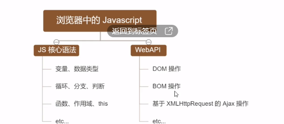
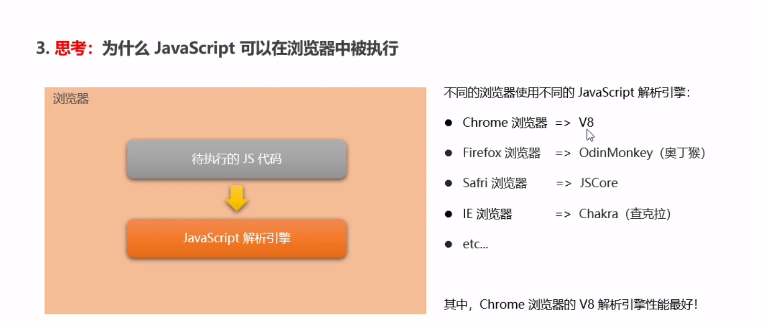

### VS code关于node.js的代码补全
**安装Typings工具**：npm install -g typings  
**查看版本**：typings -version  
**到目录下安装对应插件提示工具**：   
typings install de~node --global --save      
typings install dt~express --global  
**通过两种方式来启动提示功能**：
第一种是在需要进行只能提示的文件最上行增加提示信息文件所在目录，格式如下: 
~~~javascript
<reference path="./typings/index.d.ts" />  
~~~
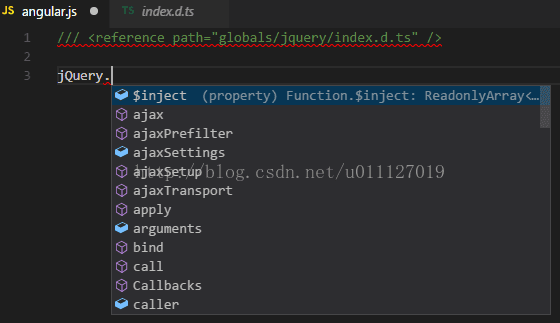  
第二种是在项目所在目录(在这里是NodeSnippet文件夹中)增加一个名为jsconfig.json的空文件。
更多jsconfig.json文件的内容可以参考：https://code.visualstudio.com/docs/languages/javascript

启用提示功能后我们就可以非常愉快的使用Visual Studio Code 为我们提供的智能提示功能了。如下所示：

————————————————
版权声明：本文为CSDN博主「天马3798」的原创文章，遵循CC 4.0 BY-SA版权协议，转载请附上原文出处链接及本声明。
原文链接：https://blog.csdn.net/u011127019/article/details/56671511

----

## 03 fs文件系统模块
### 3.1 
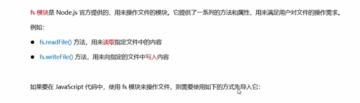

* fs.readFile()：用来读取指定文件的内容
* fs.writeFile()：用来向指定的文件中写入内容
~~~javascript
// 导入fs模块
const fs=require('fs')
// fs.readFile()格式
fs.readFile(path[,options],callback)
// 参数1：必选参数，文件路径（字符串）
// 参数2：编码格式
// 参数3：必选，返回读取结果
~~~

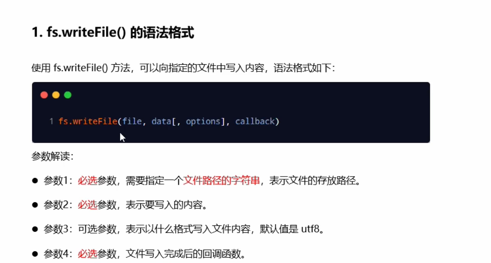

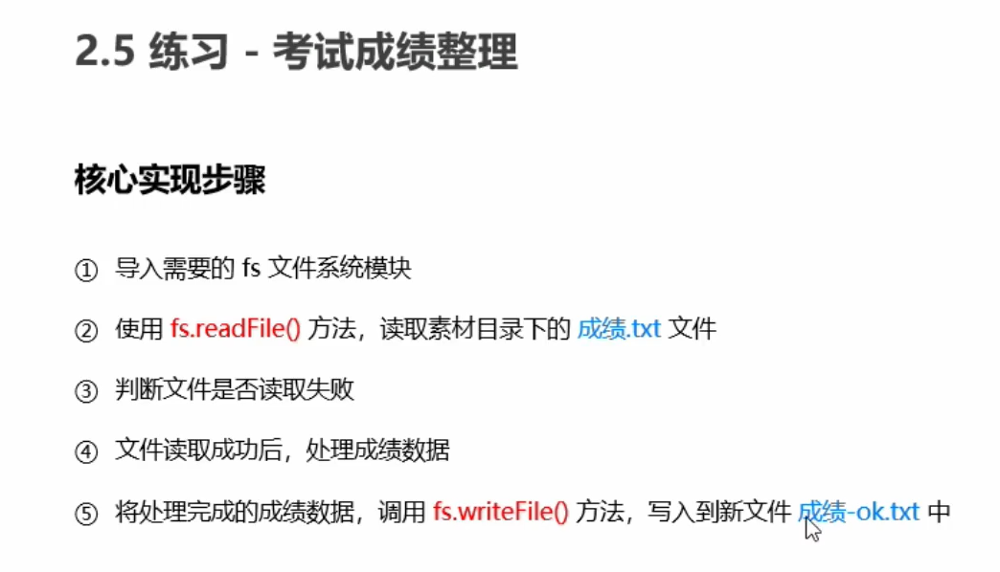

----

## 04 Http模块
> 在网络节点中，负责消费资源的电脑，叫客户端；负责对外提供网络资源的电脑，叫做服务器。

> http模块是Node.js官方提供的，用来创建web服务器的模块。通过http模块提供的http.createSever()方法，就能方便地把一台普通电脑变成一个Web服务器，从而提供Web资源服务。

~~~JavaScript
const http=require('http')
~~~

#### 服务器的相关概念
1. **IP地址**  
互联网上每台计算机的唯一地址。只有知道IP地址，才能与对应的电脑之间进行通信。
① 互联网中每台Web服务器，都有自己的IP地址。命令ping可以查看
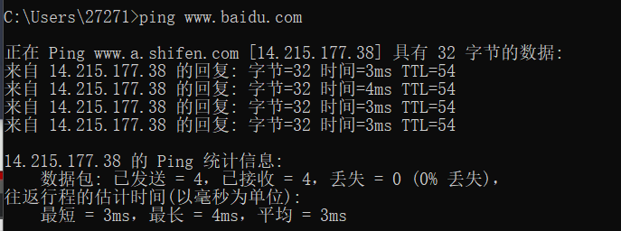
② 在开发期间，自己的电脑即是一台服务器，也是一个客户端。自身服务器地址：127.0.0.1（测试的时候）

2. **域名和域名服务器**
字符串的地址方案，域名（Donmain Name）地址
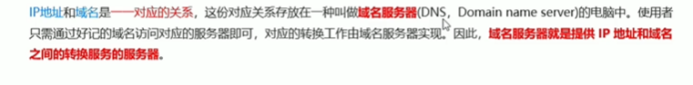
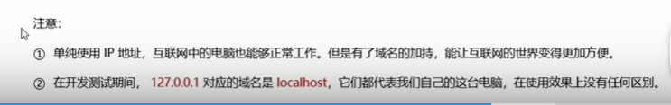
注意：
①
② 127.0.0.1 对应域名是localhost

3. **端口号**
在一台电脑中，可以运行成百上千的web服务，每个web服务都对应唯一的端口号。
客户端发送过来的网络请求，通过端口号，可以被准确地交给对应的web服务进行处理。
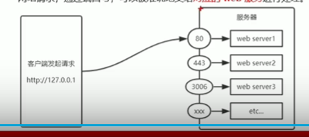
注意：
①每个端口号不能同时被多个web服务占用
②在实际应用中，URL的80端口可以被省略

#### 使用node.js创建基础的web服务器

1. 导入http模块
~~~JavaScript
const http=require('http')
~~~
2. 创建web服务器实例
调用http.createServer()方法
3. 为服务器实例绑定request事件
~~~javascript
server.on('request',(req,res)=>{
  console.log('Some visit our web Server.')
})
~~~
4. 启动服务器
~~~JavaScript
server.listen(80,()=>{
  console.log('http server running at 127.0.0.1')
})
~~~

* req请求对象

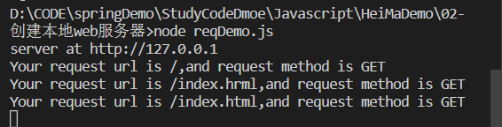

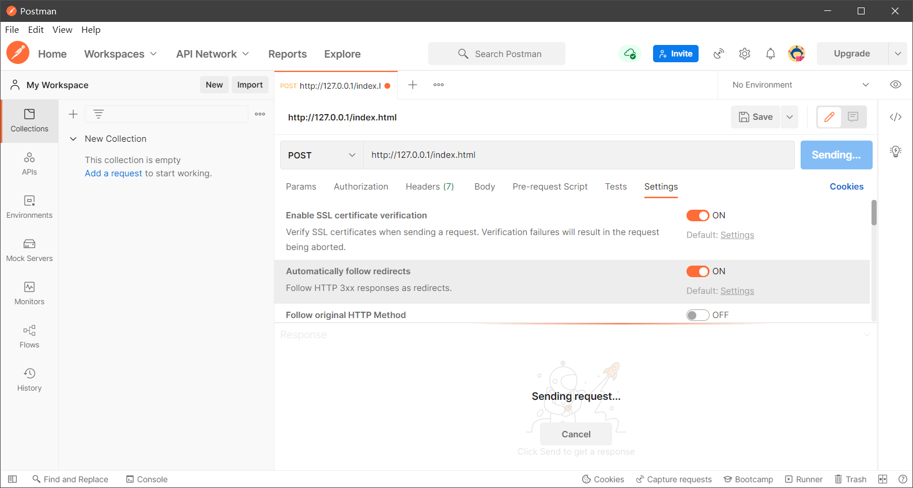

#### 根据不同的url响应不同的html内容
核心实现步骤：
1. 获取请求的url地址
2. 设置默认的响应内容为404 Not found
3. 判断用户请求的是否为/ 或 /index.html首页
4. 判断用户请求的是否为/about.html关于页面
5. 设置 Content-Type响应头
6. 使用res.end()把内容响应给客户端

#### 案例-实现clock时钟的web服务器
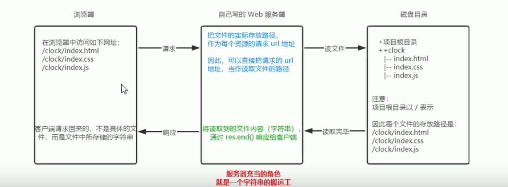
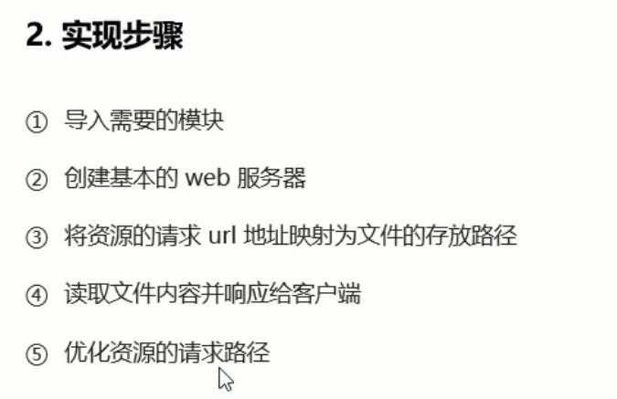

----

## 05 模块化
### 模块化基本概念
#### 1.1 基本概念

现实生活中的模块化，小霸王的游戏和主体是拆分的就是模块化思想。
编程领域中的模块化，就是遵守固定的规则，把一个大文件拆成独立并相互依赖的多个小模块。

#### 1.2 模块化规范

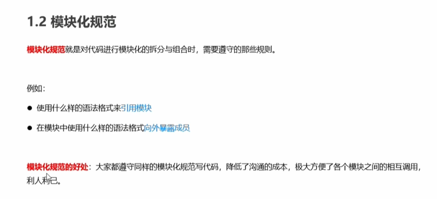

### Node.js中的模块化
#### 分类
在Node.js根据模块的来源不同，将模块分成了三大类：
* 内置模块
* 自定义模块
* 第三方模块

#### 加载模块化
 使用require()方法，可以加载需要的内置模块、用户自定义模块、第三方模块进行使用，例如：
 ~~~javascript
const fs=require('fs')
const demo=require('./demo.js')
 ~~~

 #### 模块作用域
 和函数作用域类似，
 

 好处：防止全局变量污染的问题