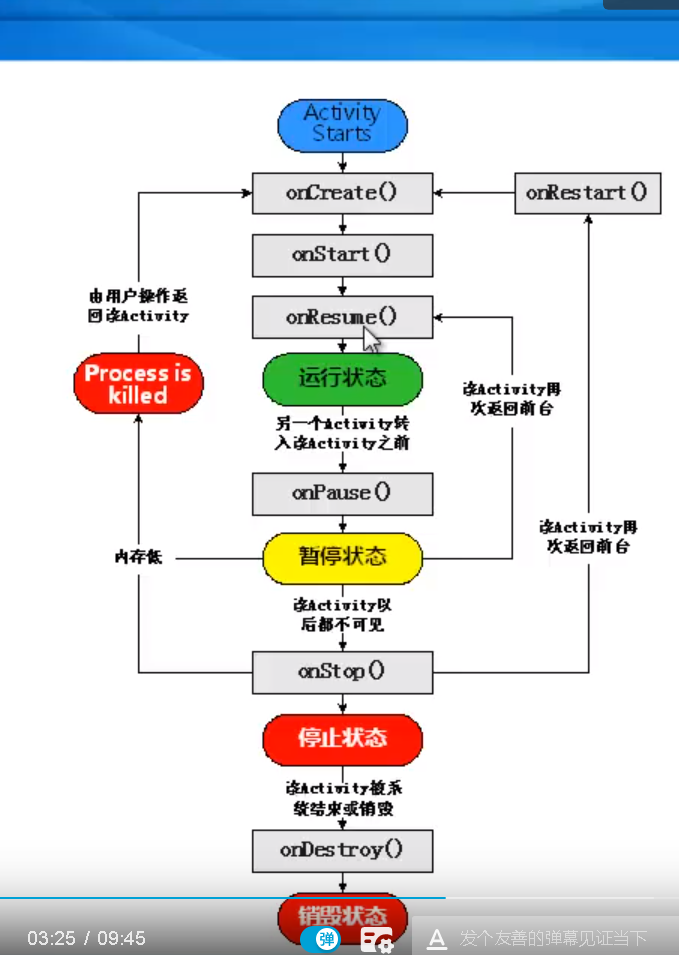
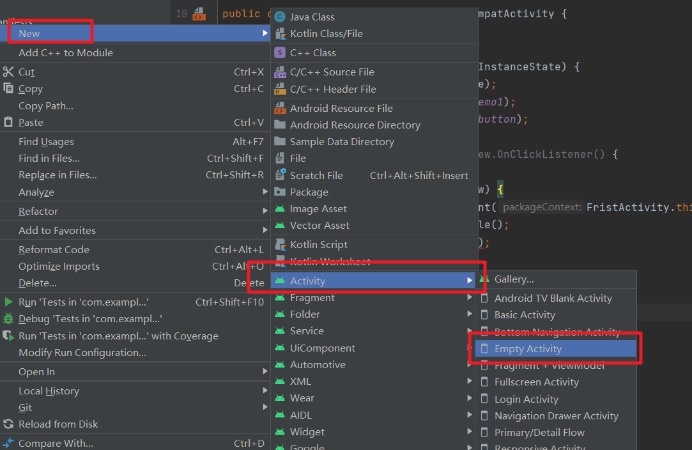
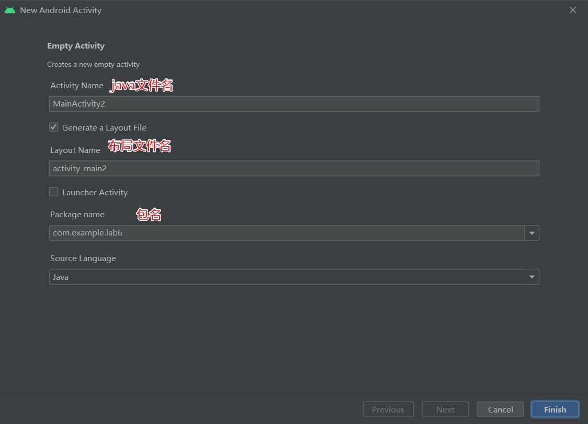
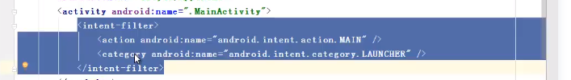
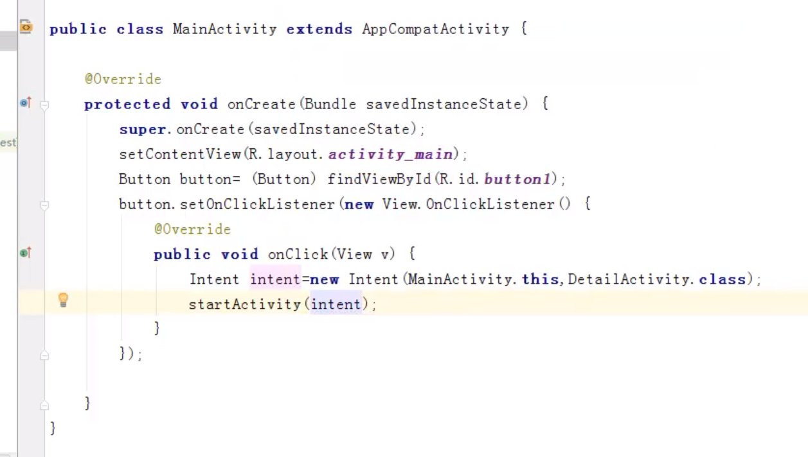
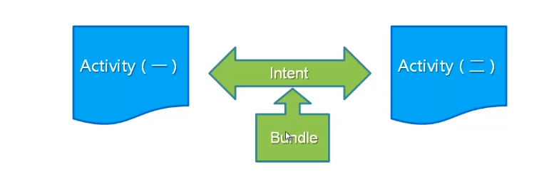
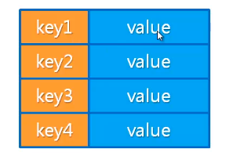
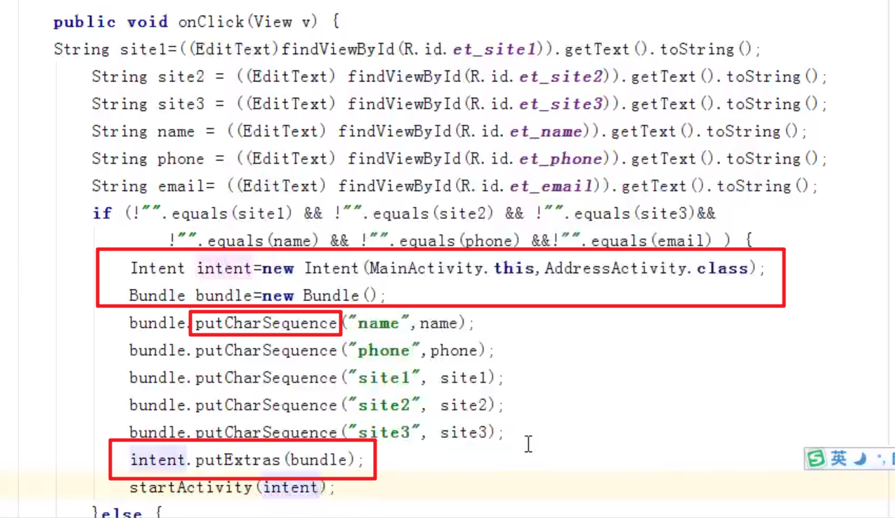
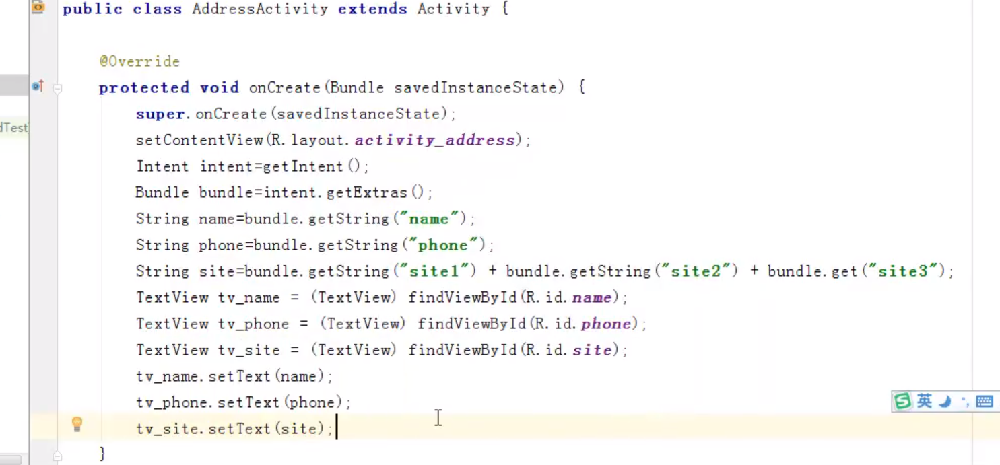

# Android开发
> https://www.bilibili.com/video/BV1jW411375J

## 一.Activity概述

### 01 activity的四种状态
运行状态：浏览页面的时候
暂停状态：弹出询问对话框
停止状态：确认对话框
销毁状态：停止或强制停止的时候
注意：全两种状态是可见的，后两者不可见

### 02 activity的生命周期

### 03 创建、启动和关闭activity
1. 创建继承自Activity的Activity
2. 重写需要回调的方法：onCreate()
3. 设置要显示的视图：setContentView(R.layout.activity_main)

**配置Activity**
1. AndroidManifest.xml配置文件
2. 使用activity标签

通过AndroidStudio创建向导创建Activity

**启动和关闭Activity**
1. 入口activity

在配置文件中配置
2. 其他activity

在startActivity中启动
intent

**关闭activity**
直接调用finish()方法

**刷新当前Activity**
调用onCreate(null)

### 04 多个Activity使用
使用Bundle在Activity之间的交换数据

什么是Bundle？

**传递数据步骤：**
将要保存的数据保存到Bundle中使用putExtras()方法，将Bundle保存到Intent中，再使用startActivity()方法调用另一个Activity

