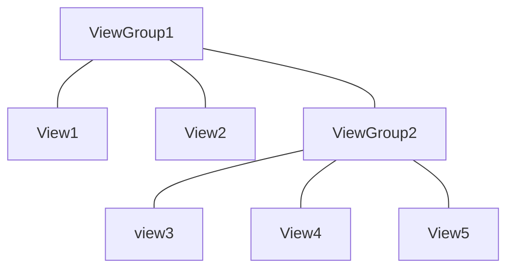

# 移动终端应用开发

## 02 Android界面布局

> 所有的UI元素都是通过View与ViewGroup构建的，对于一个Android应用的用户界面来说，ViewGroup作为容器盛装界面中的控件，它可以包含普通的View控件，也可以包含ViewGroup。

### 常用布局管理器

1. **线性布局** LineLayout：以**水平或垂直方式**来显示界面中的控件

2. **相对布局** RelativeLayot：是通过**相对定位**的方式指定子控位置，即以其他空间或父容器为参照物，摆放空间位置

3. **帧布局** FrameLayout：用于在屏幕上创建一块空白区域，添加到该区域中的每个子控件占一帧，这些帧会**一个一个叠加**在一起，后加入的控件会叠加在上一个控件上层。所有控件都默认显示在屏幕左上角

4. **表格布局** TableLayout：采用**行和列**的形式来管理UI组件。通过添加TableRow、其他组件来控制行数和列数。

5. **约束布局** ConStraintLayot：**可视化方式编写**页面布局

   

